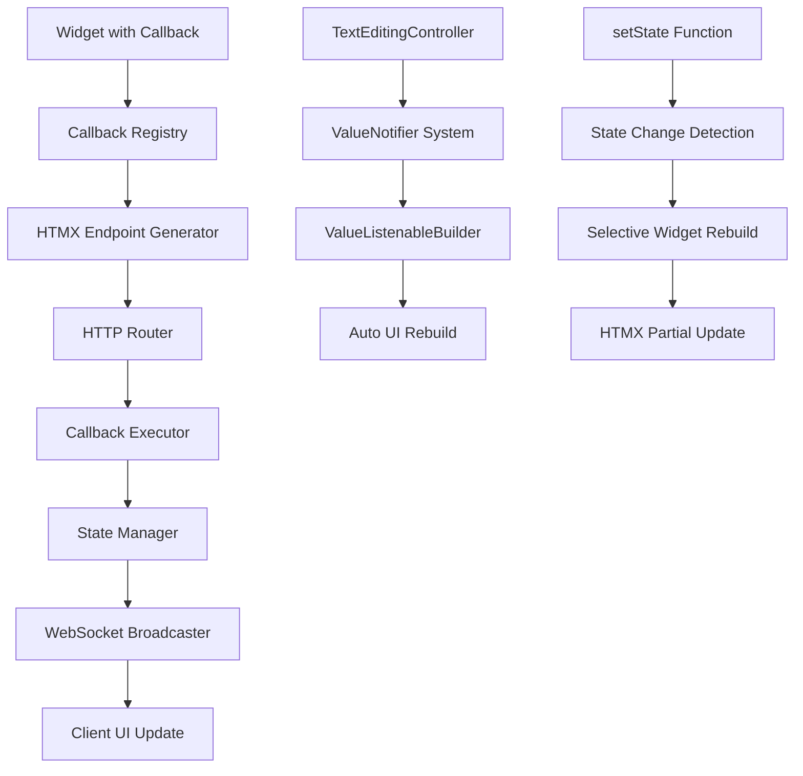

# Design Document

## Overview

This design implements a comprehensive interactive widget system for the Godin framework that enables Flutter-like callback execution on the Go backend. The system automatically handles callback registration, HTMX endpoint generation, state management integration, and real-time UI updates through WebSocket communication.

The core architecture follows the Flutter pattern where widgets declare callback functions that execute server-side Go code, with automatic UI synchronization and state management.

## Architecture

### High-Level Architecture



### Component Interaction Flow

1. **Widget Registration**: Interactive widgets register their callbacks during rendering
2. **Endpoint Creation**: Automatic HTTP endpoint generation for each callback
3. **Client Interaction**: User interactions trigger HTMX requests to generated endpoints
4. **Callback Execution**: Server executes the registered Go callback function
5. **State Updates**: Callbacks can modify state through setState() or ValueNotifiers
6. **UI Synchronization**: State changes trigger selective UI updates via HTMX/WebSocket

## Components and Interfaces

### 1. Callback Registry System

```go
// CallbackRegistry manages widget callback registration and execution
type CallbackRegistry struct {
    callbacks map[string]CallbackInfo
    mutex     sync.RWMutex
    router    *mux.Router
    stateManager *state.StateManager
}

type CallbackInfo struct {
    ID          string
    WidgetType  string
    CallbackType string
    Function    interface{}
    Context     *core.Context
    Parameters  map[string]interface{}
}

// Methods
func (cr *CallbackRegistry) RegisterCallback(widgetID, callbackType string, fn interface{}) string
func (cr *CallbackRegistry) ExecuteCallback(callbackID string, params map[string]interface{}) error
func (cr *CallbackRegistry) GenerateEndpoint(callbackID string) string
func (cr *CallbackRegistry) CleanupCallback(callbackID string)
```

### 2. TextEditingController Implementation

```go
// TextEditingController manages text input state similar to Flutter
type TextEditingController struct {
    text      string
    selection TextSelection
    notifier  *state.StringNotifier
    listeners []func(string)
    mutex     sync.RWMutex
}

type TextSelection struct {
    Start int
    End   int
}

// Methods
func NewTextEditingController(initialText string) *TextEditingController
func (tec *TextEditingController) Text() string
func (tec *TextEditingController) SetText(text string)
func (tec *TextEditingController) Clear()
func (tec *TextEditingController) Selection() TextSelection
func (tec *TextEditingController) SetSelection(selection TextSelection)
func (tec *TextEditingController) AddListener(listener func(string))
func (tec *TextEditingController) RemoveListener(listener func(string))
func (tec *TextEditingController) ValueNotifier() *state.StringNotifier
```

### 3. setState Function Implementation

```go
// StateUpdater provides Flutter-like setState functionality
type StateUpdater struct {
    context      *core.Context
    stateManager *state.StateManager
    updateQueue  chan StateUpdate
    batchTimer   *time.Timer
}

type StateUpdate struct {
    UpdateFunc func()
    WidgetIDs  []string
    Timestamp  time.Time
}

// Global setState function
func SetState(ctx *core.Context, updateFunc func()) error
func SetStateWithWidgets(ctx *core.Context, updateFunc func(), widgetIDs []string) error

// Methods
func (su *StateUpdater) QueueUpdate(update StateUpdate)
func (su *StateUpdater) ProcessBatch()
func (su *StateUpdater) TriggerRebuild(widgetIDs []string)
```

### 4. Enhanced Widget Base Classes

```go
// InteractiveWidget provides base functionality for widgets with callbacks
type InteractiveWidget struct {
    HTMXWidget
    callbackRegistry *CallbackRegistry
    widgetID        string
    registeredCallbacks map[string]string // callback type -> callback ID
}

// Methods
func (iw *InteractiveWidget) RegisterCallback(callbackType string, fn interface{}) string
func (iw *InteractiveWidget) GenerateHTMXAttributes() map[string]string
func (iw *InteractiveWidget) BuildEventHandlers() map[string]string
func (iw *InteractiveWidget) Cleanup()
```

### 5. Automatic HTMX Integration

```go
// HTMXIntegrator handles automatic HTMX attribute generation
type HTMXIntegrator struct {
    endpointPrefix string
    csrfToken     string
}

// Methods
func (hi *HTMXIntegrator) GenerateClickHandler(callbackID string) map[string]string
func (hi *HTMXIntegrator) GenerateChangeHandler(callbackID string) map[string]string
func (hi *HTMXIntegrator) GenerateSubmitHandler(callbackID string) map[string]string
func (hi *HTMXIntegrator) GenerateCustomHandler(event, callbackID string) map[string]string
```

## Data Models

### Widget Callback Mapping

```go
// CallbackMapping defines which callbacks are available for each widget type
var WidgetCallbackMappings = map[string][]string{
    "Button":                {"OnPressed"},
    "ElevatedButton":        {"OnPressed"},
    "TextButton":           {"OnPressed"},
    "OutlinedButton":       {"OnPressed"},
    "FilledButton":         {"OnPressed"},
    "IconButton":           {"OnPressed"},
    "FloatingActionButton": {"OnPressed"},
    "TextField":            {"OnChanged", "OnSubmitted", "OnEditingComplete", "OnTap"},
    "TextFormField":        {"OnChanged", "OnFieldSubmitted", "OnEditingComplete", "OnTap", "OnSaved"},
    "Switch":               {"OnChanged"},
    "Checkbox":             {"OnChanged"},
    "Radio":                {"OnChanged"},
    "Slider":               {"OnChanged", "OnChangeStart", "OnChangeEnd"},
    "InkWell":              {"OnTap", "OnDoubleTap", "OnLongPress", "OnTapDown", "OnTapUp", "OnTapCancel", "OnHighlightChanged", "OnHover"},
    "GestureDetector":      {"OnTap", "OnDoubleTap", "OnLongPress", "OnPanStart", "OnPanUpdate", "OnPanEnd", "OnScaleStart", "OnScaleUpdate", "OnScaleEnd"},
    "PageView":             {"OnPageChanged"},
    "TabBar":               {"OnTap"},
    "DropdownButton":       {"OnChanged"},
    "PopupMenuButton":      {"OnSelected"},
    "Dismissible":          {"OnDismissed", "OnResize"},
    "RefreshIndicator":     {"OnRefresh"},
}
```

### State Change Events

```go
// StateChangeEvent represents a state change that triggers UI updates
type StateChangeEvent struct {
    Type        string                 // "value_change", "widget_rebuild", "batch_update"
    SourceID    string                 // Widget or ValueNotifier ID
    AffectedIDs []string              // Widget IDs that need updates
    Data        map[string]interface{} // Change data
    Timestamp   time.Time
}
```

## Error Handling

### Callback Execution Errors

```go
// CallbackError represents errors during callback execution
type CallbackError struct {
    CallbackID   string
    WidgetType   string
    CallbackType string
    Error        error
    Context      map[string]interface{}
}

// Error handling strategies
func (ce *CallbackError) Error() string
func (ce *CallbackError) IsRecoverable() bool
func (ce *CallbackError) GetFallbackResponse() map[string]interface{}
```

### State Management Errors

```go
// StateError represents state management errors
type StateError struct {
    Operation string // "set", "get", "notify", "rebuild"
    Key       string
    Error     error
}

// Recovery mechanisms
func RecoverFromStateError(err *StateError) error
func FallbackStateValue(key string, defaultValue interface{}) interface{}
```

## Testing Strategy

### Unit Tests

1. **Callback Registry Tests**
   - Test callback registration and execution
   - Test endpoint generation
   - Test cleanup functionality
   - Test concurrent access safety

2. **TextEditingController Tests**
   - Test text manipulation methods
   - Test selection handling
   - Test listener notifications
   - Test ValueNotifier integration

3. **setState Function Tests**
   - Test state update batching
   - Test selective widget rebuilds
   - Test error handling
   - Test concurrent setState calls

4. **Widget Integration Tests**
   - Test each widget type's callback registration
   - Test HTMX attribute generation
   - Test event handler creation
   - Test cleanup on widget disposal

### Integration Tests

1. **End-to-End Interaction Tests**
   - Test complete user interaction flows
   - Test state synchronization across widgets
   - Test WebSocket real-time updates
   - Test HTMX fallback behavior

2. **Performance Tests**
   - Test callback execution performance
   - Test state update batching efficiency
   - Test memory usage with many callbacks
   - Test WebSocket message throughput

3. **Error Recovery Tests**
   - Test callback execution failures
   - Test state corruption recovery
   - Test network failure handling
   - Test graceful degradation

### Browser Tests

1. **Client-Side Integration**
   - Test HTMX request generation
   - Test DOM update handling
   - Test WebSocket connection management
   - Test user interaction capture

2. **Cross-Browser Compatibility**
   - Test on major browsers
   - Test mobile touch interactions
   - Test accessibility features
   - Test performance across devices

## Implementation Phases

### Phase 1: Core Infrastructure
- Implement CallbackRegistry system
- Create basic HTMX integration
- Set up endpoint auto-generation
- Implement basic setState functionality

### Phase 2: TextEditingController
- Implement TextEditingController class
- Integrate with ValueNotifier system
- Update TextField and TextFormField widgets
- Add selection and cursor management

### Phase 3: Widget Callback Integration
- Update all button widgets with callback support
- Implement form widget callbacks
- Add gesture detection callbacks
- Integrate InkWell and GestureDetector

### Phase 4: Advanced Features
- Implement state update batching
- Add WebSocket real-time updates
- Optimize performance and memory usage
- Add comprehensive error handling

### Phase 5: Testing and Polish
- Complete test suite implementation
- Performance optimization
- Documentation and examples
- Browser compatibility testing

## Performance Considerations

### Callback Registration Optimization
- Use efficient data structures for callback storage
- Implement callback cleanup to prevent memory leaks
- Batch endpoint registration for better performance

### State Update Optimization
- Implement update batching to reduce re-renders
- Use selective widget rebuilding
- Optimize WebSocket message frequency

### Memory Management
- Automatic cleanup of unused callbacks
- Efficient ValueNotifier lifecycle management
- Prevent memory leaks in long-running applications

## Security Considerations

### Callback Execution Security
- Validate callback parameters
- Implement rate limiting for callback execution
- Sanitize user input in callbacks

### CSRF Protection
- Generate and validate CSRF tokens
- Secure endpoint access
- Validate request origins

### State Management Security
- Prevent unauthorized state access
- Validate state changes
- Implement proper session management