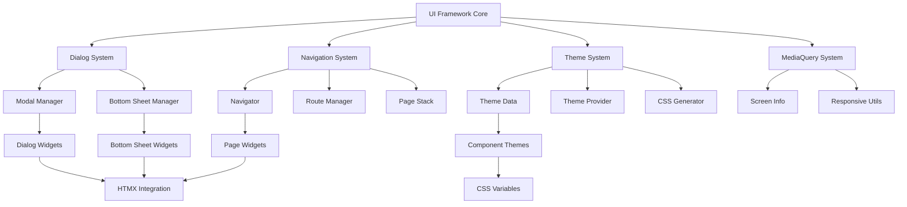

# Design Document

## Overview

This design implements comprehensive UI framework enhancements for the Godin framework, adding essential components like dialog systems, bottom sheets, navigation management, theme support, and responsive design capabilities. The system builds upon the existing InteractiveWidget foundation and integrates seamlessly with the current state management and callback systems.

The architecture follows Flutter's design patterns while adapting to Godin's server-side rendering approach with HTMX and WebSocket integration for real-time updates.

## Architecture

### High-Level Architecture



### Component Interaction Flow

1. **Dialog System**: Modal overlays managed through a centralized dialog manager
2. **Navigation System**: Page stack management with browser history integration
3. **Theme System**: Centralized theming with CSS custom properties
4. **MediaQuery System**: Responsive design utilities with real-time updates
5. **Integration Layer**: HTMX and WebSocket integration for all components

## App Integration

### Theme Injection at App Creation

```go
// App creation with theme injection
app := core.New()
app.SetTheme(widgets.DefaultLightTheme) // or custom theme
app.SetDarkTheme(widgets.DefaultDarkTheme)
app.SetThemeMode(widgets.ThemeModeSystem) // System, Light, Dark

// Alternative with theme options
app := core.NewWithOptions(core.AppOptions{
    Theme: widgets.DefaultLightTheme,
    DarkTheme: widgets.DefaultDarkTheme,
    ThemeMode: widgets.ThemeModeSystem,
})
```

## Components and Interfaces

### 1. Dialog System

```go
// DialogManager manages modal dialogs and bottom sheets
type DialogManager struct {
    activeDialogs    map[string]*DialogInfo
    activeBottomSheets map[string]*BottomSheetInfo
    mutex           sync.RWMutex
    context         *core.Context
    zIndexCounter   int
}

type DialogInfo struct {
    ID              string
    Widget          core.Widget
    BarrierDismissible bool
    OnDismiss       func()
    ZIndex          int
    CreatedAt       time.Time
}

type BottomSheetInfo struct {
    ID              string
    Widget          core.Widget
    IsModal         bool
    IsDraggable     bool
    OnDismiss       func()
    ZIndex          int
    CreatedAt       time.Time
}

// Methods
func (dm *DialogManager) ShowDialog(widget core.Widget, options DialogOptions) string
func (dm *DialogManager) ShowBottomSheet(widget core.Widget, options BottomSheetOptions) string
func (dm *DialogManager) DismissDialog(dialogID string)
func (dm *DialogManager) DismissBottomSheet(sheetID string)
func (dm *DialogManager) DismissAll()
```

### 2. Navigation System

```go
// Navigator manages page navigation and routing
type Navigator struct {
    pageStack       []*PageInfo
    routeTable      map[string]RouteHandler
    currentIndex    int
    mutex           sync.RWMutex
    context         *core.Context
    onRouteChanged  func(route string)
}

type PageInfo struct {
    ID          string
    Route       string
    Widget      core.Widget
    Parameters  map[string]interface{}
    Title       string
    CanPop      bool
    CreatedAt   time.Time
}

type RouteHandler func(ctx *core.Context, params map[string]interface{}) core.Widget

// Methods
func (n *Navigator) Push(route string, widget core.Widget) error
func (n *Navigator) Pop() error
func (n *Navigator) PushReplacement(route string, widget core.Widget) error
func (n *Navigator) PushAndRemoveUntil(route string, widget core.Widget, predicate func(*PageInfo) bool) error
func (n *Navigator) PopUntil(predicate func(*PageInfo) bool) error
func (n *Navigator) CanPop() bool
func (n *Navigator) RegisterRoute(route string, handler RouteHandler)
```

### 3. Theme System

```go
// AppOptions contains configuration options for app creation
type AppOptions struct {
    Theme      *ThemeData
    DarkTheme  *ThemeData
    ThemeMode  ThemeMode
    // Other app configuration options...
}

// ThemeData contains all theme configuration
type ThemeData struct {
    ColorScheme     *ColorScheme
    Typography      *Typography
    ComponentThemes map[string]interface{}
    Extensions      map[string]interface{}
    Brightness      Brightness
    CSS             map[string]string // CSS custom properties
}

type ColorScheme struct {
    Primary         Color
    OnPrimary       Color
    Secondary       Color
    OnSecondary     Color
    Surface         Color
    OnSurface       Color
    Background      Color
    OnBackground    Color
    Error           Color
    OnError         Color
    // Additional colors...
}

type Typography struct {
    DisplayLarge    TextStyle
    DisplayMedium   TextStyle
    DisplaySmall    TextStyle
    HeadlineLarge   TextStyle
    HeadlineMedium  TextStyle
    HeadlineSmall   TextStyle
    TitleLarge      TextStyle
    TitleMedium     TextStyle
    TitleSmall      TextStyle
    BodyLarge       TextStyle
    BodyMedium      TextStyle
    BodySmall       TextStyle
    LabelLarge      TextStyle
    LabelMedium     TextStyle
    LabelSmall      TextStyle
}

// ThemeProvider manages theme state and updates
type ThemeProvider struct {
    currentTheme    *ThemeData
    lightTheme      *ThemeData
    darkTheme       *ThemeData
    themeMode       ThemeMode
    listeners       []func(*ThemeData)
    mutex           sync.RWMutex
    cssGenerator    *CSSGenerator
}

// Methods
func (tp *ThemeProvider) SetTheme(theme *ThemeData)
func (tp *ThemeProvider) SetThemeMode(mode ThemeMode)
func (tp *ThemeProvider) GetTheme() *ThemeData
func (tp *ThemeProvider) AddListener(listener func(*ThemeData))
func (tp *ThemeProvider) GenerateCSS() string
```

### 4. MediaQuery System

```go
// MediaQueryData contains screen and device information
type MediaQueryData struct {
    Size            Size
    DevicePixelRatio float64
    TextScaleFactor  float64
    Padding         EdgeInsets
    ViewInsets      EdgeInsets
    ViewPadding     EdgeInsets
    AlwaysUse24HourFormat bool
    AccessibleNavigation  bool
    InvertColors         bool
    HighContrast         bool
    DisableAnimations    bool
    BoldText            bool
    Orientation         Orientation
    PlatformBrightness  Brightness
    Breakpoint          Breakpoint
}

type Size struct {
    Width  float64
    Height float64
}

type EdgeInsets struct {
    Top    float64
    Right  float64
    Bottom float64
    Left   float64
}

// MediaQueryProvider manages screen information and updates
type MediaQueryProvider struct {
    currentData     *MediaQueryData
    listeners       []func(*MediaQueryData)
    mutex           sync.RWMutex
    updateChannel   chan *MediaQueryData
}

// Methods
func (mqp *MediaQueryProvider) GetData() *MediaQueryData
func (mqp *MediaQueryProvider) UpdateData(data *MediaQueryData)
func (mqp *MediaQueryProvider) AddListener(listener func(*MediaQueryData))
func (mqp *MediaQueryProvider) StartListening()
```

### 5. Enhanced Scaffold System

```go
// Scaffold provides the basic layout structure
type Scaffold struct {
    InteractiveWidget
    AppBar              *AppBar
    Body                core.Widget
    FloatingActionButton *FloatingActionButton
    FloatingActionButtonLocation FABLocation
    Drawer              *Drawer
    EndDrawer           *Drawer
    BottomNavigationBar *BottomNavigationBar
    BottomSheet         core.Widget
    BackgroundColor     *Color
    ResizeToAvoidBottomInset bool
    Primary             bool
}

type AppBar struct {
    InteractiveWidget
    Title           core.Widget
    Leading         core.Widget
    Actions         []core.Widget
    BackgroundColor *Color
    ForegroundColor *Color
    Elevation       float64
    CenterTitle     bool
    TitleSpacing    float64
}

type Drawer struct {
    InteractiveWidget
    Child           core.Widget
    BackgroundColor *Color
    Elevation       float64
    Width           float64
}

type BottomNavigationBar struct {
    InteractiveWidget
    Items           []*BottomNavigationBarItem
    CurrentIndex    int
    OnTap           func(int)
    Type            BottomNavigationBarType
    BackgroundColor *Color
    SelectedItemColor *Color
    UnselectedItemColor *Color
}
```

### 6. Form System Enhancements

```go
// Form manages form state and validation
type Form struct {
    InteractiveWidget
    Key             *GlobalKey
    Child           core.Widget
    OnChanged       func()
    AutovalidateMode AutovalidateMode
    formState       *FormState
}

type FormState struct {
    fields          map[string]*FormFieldState
    isValid         bool
    hasError        bool
    mutex           sync.RWMutex
}

// Methods
func (fs *FormState) Validate() bool
func (fs *FormState) Save()
func (fs *FormState) Reset()
func (fs *FormState) RegisterField(key string, field *FormFieldState)
func (fs *FormState) UnregisterField(key string)
```

### 7. Notification System

```go
// ScaffoldMessenger manages snackbars and notifications
type ScaffoldMessenger struct {
    activeSnackBars map[string]*SnackBarInfo
    queue          []*SnackBarInfo
    mutex          sync.RWMutex
    context        *core.Context
}

type SnackBarInfo struct {
    ID          string
    Content     core.Widget
    Action      *SnackBarAction
    Duration    time.Duration
    Behavior    SnackBarBehavior
    BackgroundColor *Color
    CreatedAt   time.Time
    DismissedAt *time.Time
}

type SnackBarAction struct {
    Label    string
    OnPressed func()
    TextColor *Color
}

// Methods
func (sm *ScaffoldMessenger) ShowSnackBar(snackBar *SnackBar) string
func (sm *ScaffoldMessenger) HideCurrentSnackBar()
func (sm *ScaffoldMessenger) ClearSnackBars()
```

## Data Models

### Theme Configuration

```go
// Predefined theme configurations
var (
    DefaultLightTheme = &ThemeData{
        ColorScheme: &ColorScheme{
            Primary:      Color{R: 103, G: 80, B: 164, A: 255}, // Material Purple
            OnPrimary:    Color{R: 255, G: 255, B: 255, A: 255},
            Secondary:   Color{R: 3, G: 218, B: 198, A: 255},   // Material Teal
            OnSecondary: Color{R: 0, G: 0, B: 0, A: 255},
            Surface:     Color{R: 255, G: 255, B: 255, A: 255},
            OnSurface:   Color{R: 0, G: 0, B: 0, A: 255},
            Background:  Color{R: 255, G: 255, B: 255, A: 255},
            OnBackground: Color{R: 0, G: 0, B: 0, A: 255},
            Error:       Color{R: 211, G: 47, B: 47, A: 255},
            OnError:     Color{R: 255, G: 255, B: 255, A: 255},
        },
        Brightness: BrightnessLight,
    }

    DefaultDarkTheme = &ThemeData{
        ColorScheme: &ColorScheme{
            Primary:      Color{R: 187, G: 134, B: 252, A: 255},
            OnPrimary:    Color{R: 0, G: 0, B: 0, A: 255},
            Secondary:   Color{R: 129, G: 199, B: 132, A: 255},
            OnSecondary: Color{R: 0, G: 0, B: 0, A: 255},
            Surface:     Color{R: 18, G: 18, B: 18, A: 255},
            OnSurface:   Color{R: 255, G: 255, B: 255, A: 255},
            Background:  Color{R: 0, G: 0, B: 0, A: 255},
            OnBackground: Color{R: 255, G: 255, B: 255, A: 255},
            Error:       Color{R: 244, G: 67, B: 54, A: 255},
            OnError:     Color{R: 0, G: 0, B: 0, A: 255},
        },
        Brightness: BrightnessDark,
    }
)
```

### Responsive Breakpoints

```go
// Responsive breakpoint definitions
type Breakpoint string

const (
    BreakpointXS Breakpoint = "xs" // < 576px
    BreakpointSM Breakpoint = "sm" // >= 576px
    BreakpointMD Breakpoint = "md" // >= 768px
    BreakpointLG Breakpoint = "lg" // >= 992px
    BreakpointXL Breakpoint = "xl" // >= 1200px
)

var BreakpointValues = map[Breakpoint]float64{
    BreakpointXS: 0,
    BreakpointSM: 576,
    BreakpointMD: 768,
    BreakpointLG: 992,
    BreakpointXL: 1200,
}
```

## Error Handling

### Dialog System Errors

```go
// DialogError represents errors in the dialog system
type DialogError struct {
    Type        string // "show", "dismiss", "render"
    DialogID    string
    DialogType  string // "dialog", "bottom_sheet"
    Error       error
    Context     map[string]interface{}
}

// Error handling strategies
func (de *DialogError) Error() string
func (de *DialogError) IsRecoverable() bool
func (de *DialogError) GetFallbackWidget() core.Widget
```

### Navigation Errors

```go
// NavigationError represents navigation-related errors
type NavigationError struct {
    Type        string // "push", "pop", "route_not_found"
    Route       string
    Error       error
    StackTrace  []*PageInfo
}

// Recovery mechanisms
func (ne *NavigationError) Error() string
func (ne *NavigationError) CanRecover() bool
func (ne *NavigationError) GetFallbackRoute() string
```

### Theme Errors

```go
// ThemeError represents theme-related errors
type ThemeError struct {
    Type        string // "load", "apply", "css_generation"
    ThemeID     string
    Error       error
    FallbackTheme *ThemeData
}

// Recovery mechanisms
func (te *ThemeError) Error() string
func (te *ThemeError) GetFallbackTheme() *ThemeData
func (te *ThemeError) RegenerateCSS() string
```

## Testing Strategy

### Unit Tests

1. **Dialog System Tests**
   - Test dialog creation and dismissal
   - Test bottom sheet functionality
   - Test z-index management
   - Test barrier dismissal behavior

2. **Navigation System Tests**
   - Test page stack operations
   - Test route registration and resolution
   - Test browser history integration
   - Test navigation guards

3. **Theme System Tests**
   - Test theme switching
   - Test CSS generation
   - Test theme inheritance
   - Test responsive theme updates

4. **MediaQuery Tests**
   - Test screen size detection
   - Test orientation changes
   - Test accessibility settings
   - Test breakpoint calculations

### Integration Tests

1. **End-to-End UI Tests**
   - Test complete user flows with dialogs
   - Test navigation between pages
   - Test theme switching across components
   - Test responsive behavior

2. **Performance Tests**
   - Test dialog rendering performance
   - Test navigation transition speed
   - Test theme switching performance
   - Test memory usage with multiple dialogs

3. **Browser Compatibility Tests**
   - Test across major browsers
   - Test mobile responsiveness
   - Test accessibility features
   - Test keyboard navigation

## Implementation Phases

### Phase 1: Core Infrastructure
- Implement DialogManager and basic dialog system
- Create Navigator and basic routing
- Set up ThemeProvider foundation
- Implement MediaQueryProvider

### Phase 2: Dialog System
- Complete showDialog functionality
- Implement showBottomSheet
- Add dialog animations and transitions
- Integrate with existing callback system

### Phase 3: Navigation System
- Complete Navigator implementation
- Add browser history integration
- Implement named routes
- Add navigation guards and lifecycle

### Phase 4: Theme System
- Complete ThemeData implementation
- Add CSS generation system
- Implement theme switching
- Add component-specific theming

### Phase 5: MediaQuery and Responsive Design
- Complete MediaQuery implementation
- Add responsive utilities
- Implement breakpoint system
- Add accessibility support

### Phase 6: Enhanced Components
- Upgrade Scaffold with new features
- Implement enhanced form system
- Add notification system
- Complete integration testing

## Performance Considerations

### Dialog System Optimization
- Lazy loading of dialog content
- Efficient z-index management
- Memory cleanup on dialog dismissal
- Optimized animation performance

### Navigation Optimization
- Route caching for faster navigation
- Lazy loading of page components
- Efficient page stack management
- Browser history optimization

### Theme System Optimization
- CSS custom property caching
- Efficient theme switching
- Minimal DOM updates during theme changes
- CSS generation optimization

### MediaQuery Optimization
- Debounced resize event handling
- Efficient breakpoint calculations
- Cached media query results
- Optimized responsive updates

## Security Considerations

### Dialog Security
- Prevent XSS in dialog content
- Validate dialog parameters
- Secure callback execution
- Proper cleanup of sensitive data

### Navigation Security
- Route parameter validation
- Prevent unauthorized navigation
- Secure deep linking
- CSRF protection for navigation

### Theme Security
- Sanitize CSS custom properties
- Prevent CSS injection
- Validate theme data
- Secure theme switching

## Browser Integration

### History API Integration
- Proper browser back/forward handling
- URL synchronization with navigation
- Deep linking support
- State preservation across refreshes

### CSS Custom Properties
- Modern browser support for theming
- Fallback support for older browsers
- Efficient CSS variable updates
- Performance optimization

### Responsive Design
- CSS media queries integration
- Viewport meta tag handling
- Touch and gesture support
- Accessibility compliance